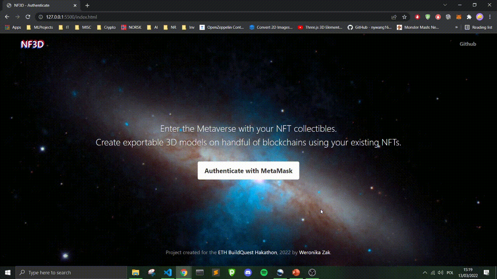

  

  

    NFT 2D to 3D generator. Make your own 3D models to be used as game avatars.
     
     
    <strong>Developed by
    <a href="https://www.linkedin.com/in/weronikawzak/">Weronika Zak</a> 
    for the 
    <a href="https://buildquest.ethglobal.com/">ETH BuildQuest Hakathon 2022</a>.
      </strong> 
  

## About the App:

Built using Moralis Vanilla JS boilerplate. The project is based heavily on **Bootstrap**, **Javascript**, and foremost 3D manipulating library **Three.js**. The models were modelled by me in **Blender**. 

After logging in with **Metamask**, the user  will be able to view a gallery of all of their NFTs.
The user can see their selected 2D NFT formed into a 3D model after clicking on it (*for now only available for some Bored Apes*).

The **Covalent** along with **NFTPort APIs** handle the data about each NFT, as well as their metadata with unique traits.

After clicking the minting button, the hot wallet message pops up. After accepting the transaction, the model is being converted to **JSON** format and NFT metadata is saved to **IPFS** storage.

  

  <a href="https://showcase.ethglobal.com/buildquest/nf3d-jhwmp">Click here to see the official showcase </a>

## Examples:

### Authenticate with MetaMask

  

### Convert your NFTs to 3D models

  

### Mint the NFT model

  

## Neural Network

Before I thought of using Covalent API to retrieve traits, I trained a neural network in PyTorch to recognise Apes and retrieve their traits based just on their image. 

The data was scrapped using Covalent API and NFTPort API. 

orks with 99.99% accuracy, and all of the (not-so-clean) code is kept in the `AI` folder.

  

