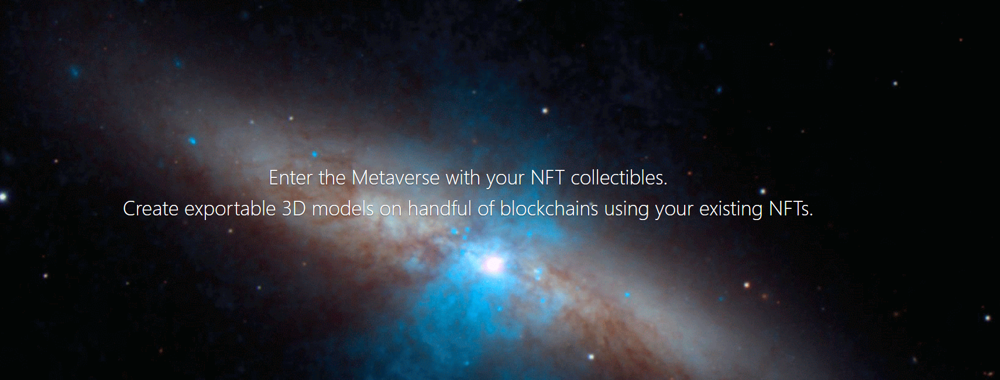

  

  

    2D to 3D generator for NFTs. Create your own 3D models to use as a game avatar.
     
     
    <strong>Developed by</strong> 
    <a href="https://www.linkedin.com/in/weronikawzak/">Weronika Zak</a> 
    for the 
    <a href="https://buildquest.ethglobal.com/">ETH BuildQuest Hakathon 2022</a>.
  

## About the App:

Built on using Moralis boilerplate. The project is based heavily on Bootstrap, Javascript, and foremost 3D manipulating library Three.js. 
The models were modeled by me in Blender. After logging in using Moralis' authentication services, the user can see a gallery of their all NFTs.
After clicking on an NFT, the user can see their selected 2D NFT formed into a 3D model (for now only available for some Bored Apes).
The data about each NFT along with their metadata with unique traits is handled by the Covalent API. 
After clicking the minting button, the hot wallet message pops up (Metamask). After accepting the transaction, the model's JSON and NFT metadata is being saved to IPFS storage. 

  

  <a href="https://showcase.ethglobal.com/buildquest/nf3d-jhwmp">Click here to see the official showcase </a>

## Examples:

### Authenticate with MetaMask

  

### Convert your NFTs to 3D models

  

### Mint the NFT model

  

## Neural Network

As a fun fact, before I came up with an idea to use Covalent API to retrieve traits, I trained a neural network using PyTorch to recognize Apes and get their traits based on just their image. The data was scrapped using Covalent API (for Bored Apes) and NFTPort API (for cryptopunks). 
It works with 99,99% accuracy and all the (not s clean) code is located in the AI folder.

  

